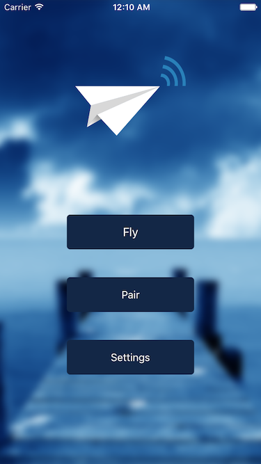

<b><a href="#overview">Overview</a></b>
|
<b><a href="#features">Screenshot</a></b>
|
<b><a href="#credits">Credits</a></b>
|
<b><a href="#license">License</a></b>

## Overview

Omega-Splicer is a project from Epitech students as part of the EIP (Epitech Innovative Project).

The primary goal of the application is to control a paper plane with the Omega-Splicer module on it.
The application is also available on [Android](https://github.com/Omega-Splicer/Android).

## Screenshot

## Credits

Fournier Charles-Adrien : https://fr.linkedin.com/in/charlesadrienfournier

## License

Licensed under the MIT license.
